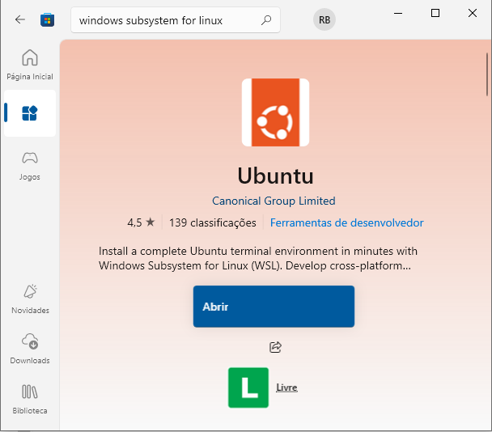

## Guia para Rodar o Aplicativo

Este repositório contém uma aplicação **Angular 19.9.0** e **.NET 8**, preparada para rodar em um ambiente com **Docker** e **WSL2** (se estiver no windows).  

Siga cuidadosamente os passos abaixo para configurar e executar o projeto localmente em caso de você querer debugar.

---

## Pré-requisitos para Rodar o projeto

- ter o `Docker` instalado na máquina. Para tal é necessário uma distribuição Linux instalada (se você estiver no Windows).
- Vá em [https://www.docker.com/get-started/](https://www.docker.com/get-started/) e instale o docker

---

## Execução Rápida

Se você já tem o Docker instalado e em execução, basta executar o script:

- No **Windows**: dê um duplo clique no arquivo `up.bat`
- Ou, via terminal:
  ```bash
  up.bat
  ```
- Abra o Navegador e Acesse:
    ```
    http://localhost:4200
    ```  
- obs: Demora bastante pra terminar e buildar a primeira vez, pois você ainda não tem as imagens dos containers na sua máquina.
- **Infelizmente não houve tenpo suficiente para testar a aplicação usando esse script, mas é possível usar o script `up.dev.bat`, de forma análoga**, ou veja a seção `Executando o Código` mais adiante.

Isso iniciará todos os serviços necessários para rodar a aplicação. Nenhum outro pré-requisito é necessário além do Docker.

---

## Pré-requisitos para Rodar Localmente (para debugar, caso haja interesse)

Caso queira rodar o projeto **localmente**, é possível utilizar o script `up.dev.bat`, que se encontra na pasta docker, mas será necessário instalar a infraestrutura abaixo na sua máquina (além do Docker):

## Infraestrutura Necessária
- **Node.js 19.9.0**  
  - Baixe a versão 19.9.0: [Node.js v19.9.0 Download](https://nodejs.org/download/release/v19.9.0/)  
    - Para Windows: baixe o arquivo `node-v19.9.0-x64.msi`  
    - Para outros sistemas, escolha a vversão compatível.  
  - Após instalar, confirme a versão executando no terminal:
    ```bash
    node -v
    ```
    O retorno deve ser:
    ```
    v19.9.0
    ```

- **.NET 8**  
  - Baixe e instale: [Download .NET 8](https://dotnet.microsoft.com/en-us/download/dotnet/8.0)

## Instalar Uma Distribuição Linux (caso sua máquina não tenha)

1. Pressione `Win + S` e digite **"Windows subsystem for Linux"**.



2. Clique em **OK** e reinicie o computador quando solicitado.

## Atualizar para o WSL2
- Na pasta `instalador-wsl2`, há um `.msi` baixado de fontes oficiais para facilitar. É só instalar ele.

**ou**
- Na pasta `instalador-wsl2`, rode o `wsl2.bat`.

**ou**

- Vá em [https://aka.ms/wsl2kernel](https://aka.ms/wsl2kernel) e siga os passos

---

## Executando o Código
1. Garanta que você tem o **Docker**, o **.NET 8** e o **Node.js 19.9.0** (rodando nessa versão) na sua máquina.

2. Abra o terminal e navegue até a pasta **`docker`** do projeto:
    ```bash
    cd docker
    ```

3. Execute o Script **`up.dev.bat`**:
    - No **Windows**: dê um duplo clique no arquivo `up.dev.bat`
    - Ou, via terminal:
      ```bash
      up.dev.bat
      ```

4. Aguarde Até que Todos os Serviços Sejam Iniciados Corretamente.

5. Abra o Navegador e Acesse:
    ```
    http://localhost:4200
    ```

---

## Observações
- Caso ocorra erro relacionado à versão do Node.js, verifique se está realmente usando **v19.9.0**.  
- Certifique-se de que o **Docker** está rodando antes de executar o `up.dev.bat` ou `up.bat`.  
- Se estiver usando **Linux ou MacOS**, será necessário adaptar os `.bat` para os scripts equivalente `.sh`.
